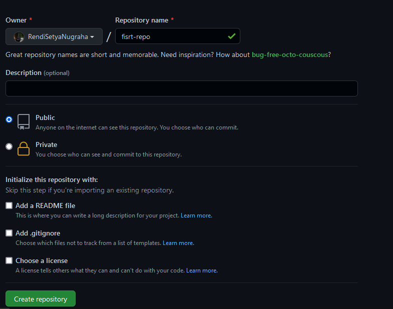

# Langkah - langkah Praktik Github

Setelah Melakukan Create Akun dan verifikasi email, Kita bisa melengkapi profil, Setelah itu :

#### 1. Membuat Repository
---

Di sini, kita dapat mengisi sendiri melalui penjelasan singkat di bawah ini :
* Repository name : kolom untuk menamai repo yang ingin dibuat.
* Description : kolom untuk mendeskripsikan repo yang ingin dibuat. Sifatnya opsional yaitu boleh diisi atau tidak.
* Visibility : terdapat dua opsi penampilan repo yaitu “public” dan “private”. Pilih public jika ingin dilihat oleh pengguna lain/pilih private jika hanya ingin dilihat sendiri.
* Initialize this repository : terdapat beberapa opsi untuk mengatur project baru yang akan kamu buat. Opsi pertama dengan pemasangan file *“Readme”*. Readme selalu ada di setiap repository untuk menjelaskan penjelasan singkat/detail, cara penggunaan, dan sebagainya. Jika ingin dibuat secara otomatis oleh GitHub, checklist tombolnya.
* Jika merasa sudah sesuai, dengan menekan tombol “Create repository”.

**Pengelolaan github untuk berkolaborasi mengelola pekerjaan/Tugas**

Setelah mengikuti dan menyelesaikan proses instalasi git di lokal, setelah itu:

#### 2. git clone
Secara singkat perintah "git clone" digunakan untuk mengunduh code yang ada pada repository.
> $ git clone https://github.com/RendiSetyaNugraha/first-repo.git

Masuk ke direktori first-repo
> $ cd first-repo

kita lakukan perubahan branch menjadi main, setelah membuat repo karena Git lokal masih menggunakan istilah master. Cara melakukan perubahan:
> $ git branch -m main

Setelah berhasil menjalankan perintah git clone, kita akan menambahkan folder baru yang diberi nama **coba-coba**
> $ mkdir coba-coba

Atau kita juga bisa membuat folder tersebut di file explorer setelah menjalankan perintah diatas maka akan ada folder baru dengan nama coba-coba, selanjutnya berpindah ke folder / directory yang telah dibuat tadi, dengan menggunakan perintah:
> $ cd coba-coba

setelah berada di folder / directory "coba-coba", pada langkah ini akan mencoba menambahkan file baru yang di beri nama "praktik_coba.md" di kode editor, di sini saya memakai vscode.

sampai pada langkah ini kita telah berhasil menambahkan folder "coba-coba" dan di dalam folder tersebut telah ada file "praktik_coba.md"

#### 3. git add
Setelah menambahkan file baru, kita juga bisa mengedit isi file tersebut di vscode, setelah selesai, save.
Tapi itu baru menyimpan di vscode saja belum di git nya

> $ git add .

Dengan menggunakan perintah ini, maka artinya sama aja kita menyuruh agar di git untuk melakukan penambahan (add) pada semua file dalam folder

Perintah selanjutnya
> $ git commit -m "<isi pesan>"
 